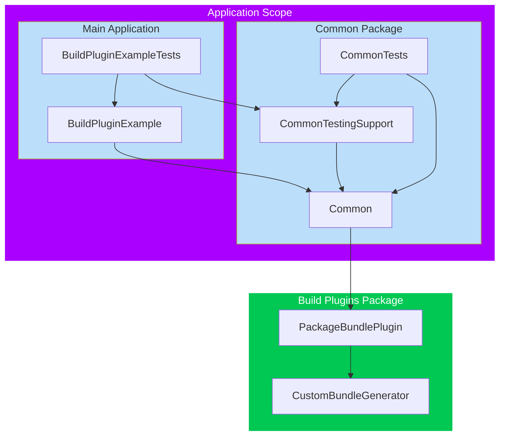

# Incorrect SPM Build Tool Plugin Dependency Analysis Example (Xcode)

This repository contains an example configuration of an iOS project that simulates a real-world application and illustrates the problems encountered when executing Build Tool plug-ins while compiling the application for testing.

Below is a brief description of the project configuration along with some investigation details to date.

## Configuration

The project consists of:

* The main application executable (`BuildPluginExample`)
* An integrated SPM package (`Common`), with three targets:
    * `Common` (also a library product), which contains logic for accessing resource bundles and references the build-tool plug-in.
    * `CommonTestingSupport` (also a library product), which contains a mock implementation of the protocol declared in `Common`.
    * `CommonTests` – a testing target that depends on both `Common` and `CommonTestingSupport`.
* A standalone build tool plug-in package (`BuildPlugins`), referenced by the `Common` package, with several targets:
    * `PackageBundlePlugin` (also the product) – a build-tool plug-in that uses the `CustomBundleGenerator` executable target.
    * `CustomBundleGenerator` – an executable target that contains code-generation logic.
* The main application testing bundle depends on the `CommonTestingSupport`.



## Reproducing the problem
Simply try to either run any of the existing tests from Xcode (using the diamond button) or just build the application for testing (cmd + shift + U). The build process will fail with the following message:
```
Build input file cannot be found: 'derived-data/BuildPluginExample-<hash>/SourcePackages/plugins/common.output/Common/PackageBundlePlugin/ResourceBundle.g.swift'. Did you forget to declare this file as an output of a script phase or custom build rule which produces it? (in target 'Common' from project 'Common')
```

## Observations
### `Common` package can be built successfully on its own
When building the Common package either via `swift build` or `xcodebuild` (in Xcode), the build plug-in works as expected and the generated file is produced.


### Only fails on the first build
Once there has been a _successful_ execution of the build-tool plug-in, subsequent compilations work as expected and can be built without any issues. However, the problem reoccurs once the derived data folder is cleared, making this approach non-feasible for CI or other developer machines.

### It's only when building for testing
When building the application to run (not for testing), the issue does not occur, and the application builds normally. The generated file is accessible after generation, and the override of the bundle locations works as expected.

### Linking matters
Due to the specifics of dependency handling, the behavior of the `Common` target may become unpredictable, likely resulting in differences between release and testing modes. In release mode, the library is linked _statically_, while in testing, it is linked _dynamically_ when `BuildPluginExampleTests` are built. This difference in linking seems to affect the behavior of the build plug-in, resulting in inconsistencies in the build process when the type of the `Common` library is not deterministic.

When changing the `Common` library type to `dynamic`, the build plug-in works as expected. However, applying this change to other libraries could introduce regressions in the application’s bootstrap process in production.

